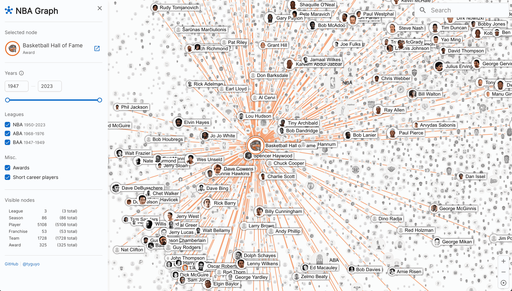
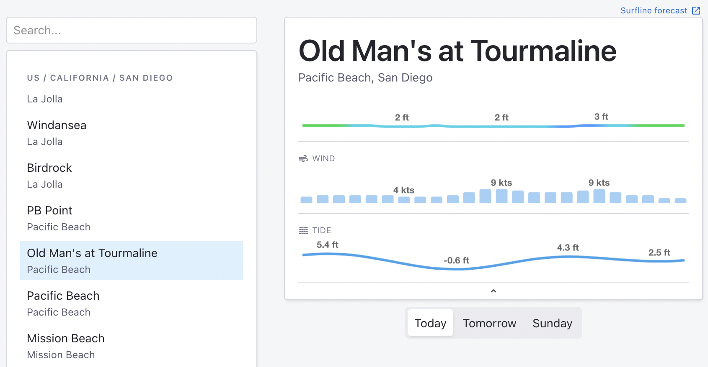
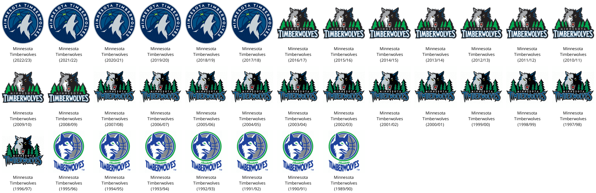
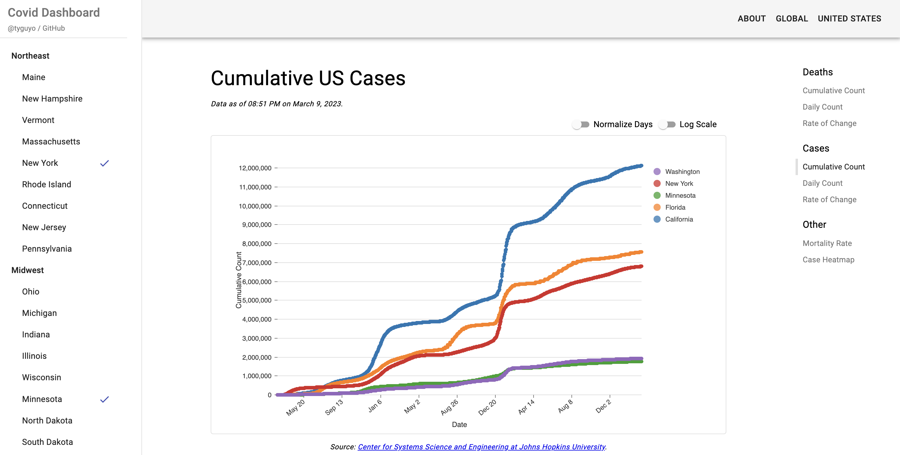

# Tyler Olson


Just a place to put some things. Take a look or get in touch : )

## Projects

### NBA Graph
All of NBA history, visualized as a large graph. 




([site](https://nbagraph.com), [github](https://github.com/TGOlson/nba-graph))
### tiny surf
Minimal UI for viewing surf forecasts.



([github](https://github.com/TGOlson/tiny-surf))

### nba-logos 
Catalog of NBA logos over time. Programmatically created using scrapped data and images from [basketball-reference.com](http://www.basketball-reference.com).



([album](https://imgur.com/a/7hYM1s2), [reddit](https://www.reddit.com/r/nba/comments/10ryoq1/nba_team_logos_over_time/), [github](https://github.com/TGOlson/nba-logos))

### blockchain
Generic blockchain implementation in Haskell. Heavily inspired by Bitcoin blockchain, but does not fully comply to the Bitcoin blockchain spec. Published on [hackage](https://hackage.haskell.org/package/blockchain), and used to implement a hacky-but-working test [blockchain-network](https://github.com/TGOlson/blockchain-network).

```hs
data Blockchain a = Blockchain
    { _config :: BlockchainConfig
    , _node   :: BlockchainNode
    }

data BlockchainNode = BlockchainNode
    { nodeBlock :: Block
    , nodeNodes :: [BlockchainNode]
    }
```
([github](https://github.com/TGOlson/blockchain))

### covid-viz 
Dashboard for various covid visualizations. Built during early 2020 to track outbreak data. Still functioning, but some pieces may no longer be up to date. Data from by Johns Hopkins CSSE.



([site](https://tgolson.net/covid-viz), [github](https://github.com/TGOlson/covid-viz))

### woot
Libraries for creating real time collaborative documents without operational transformation (WOOT). Based on Open Science [research doc](https://hal.inria.fr/inria-00071240/document). Published to [npm](https://www.npmjs.com/package/woot-js) and [hackage](https://hackage.haskell.org/package/woot). 

([javascript library](https://github.com/TGOlson/woot-js), [haskell library](https://github.com/TGOlson/woot-haskell))

### o-validator
Flexible and lightweight object validation library for Javascript. Focusing on functional programming and composability concepts. Published in 2015. Over [85k lifetime downloads](https://npm-stat.com/charts.html?package=o-validator&from=2010-01-01).

([npm](https://www.npmjs.com/package/o-validator), [github](https://github.com/TGOlson/o-validator))

## Smaller things
* surfline ([npm](https://www.npmjs.com/package/surfline), [github](https://github.com/TGOlson/surfline)): Surfline API bindings and types in JS
* quick-sprite ([npm](https://www.npmjs.com/package/quick-sprite), [github](https://github.com/TGOlson/quick-sprite)): Small util for generating sprites from multiple images
* bip39 ([github](https://github.com/TGOlson/bip39)): Haskell implementation of the [bip39 protocol](https://github.com/bitcoin/bips/blob/master/bip-0039.mediawiki)
* gpio ([hackage](https://hackage.haskell.org/package/gpio), [github](https://github.com/tgolson/gpio)): RaspberryPi GPIO interface in Haskell
* pixel ([github](https://github.com/TGOlson/pixel)): Non-fungible token built on ethereum, hacky-working custom UI
* dupertest ([npm](https://www.npmjs.com/package/dupertest), [github](https://github.com/TGOlson/dupertest)): Node library for unit testing controller actions ([>30k lifetime downloads](https://npm-stat.com/charts.html?package=dupertest&from=2010-01-01))
* tggl-prjct ([site](https://tgolson.net/tggl-prjct/), [github](https://github.com/TGOlson/tggl-prjct)): Library for UI slide toggle buttons (one of the first things I ever built, fun!)

## Writing
### Efficient Ethereum Smart Contract Storage
Writeup on potential ways to optimize Ethereum gas usage (and in turn save $$$) when executing operations via a smart contract. 
([medium](https://medium.com/@tyguyo/efficient-ethereum-smart-contract-storage-361e4f126bbd))

### Other old stuff
Other older (pre-2016) things I’ve written, available to browse on Medium. Some fun stuff in there. 
([medium](https://medium.com/@tyguyo))


## Contact
* [Github](https://github.com/TGOlson) 
* [Linkedin](https://www.linkedin.com/in/tylergolson/)
* [Twitter](https://twitter.com/TyGuyO) (not much here, but feel free to DM!)
* Email => `hello@tgolson.net`
